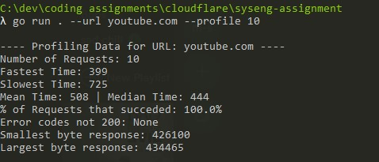
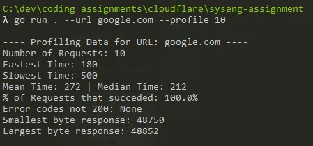
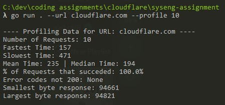
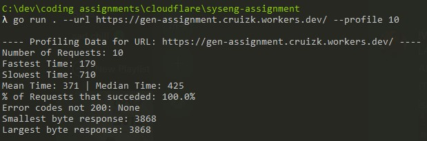
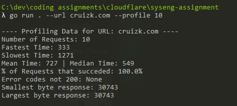
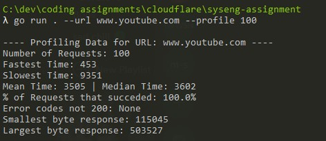

# System Assignment using GO

## How to run
Be in the root folder and run `go run . --help` for commands
Flags: 
`--url <URL> The URL that will be requests and print the body`
`--profile <REQUEST_COUNT> Profile request at <URL> <REQUEST_COUNT> times`

## Technical Stuff
All http connections are made using GO tls sockets for https connections
Any 300 redirects will follow the location and will only return HTTPResponse of a non 300 destination
A request will timeout after 10s of no response, this gets reset for each redirct.
Most of the time high volume requests will not work because they are all sent at once, If it was my own application I would have a --timeout flag to specify a main thread sleep time between requests, but I wanted to keep within the specification given
I had never used GO prior to starting this assignment on 10/9, so it was really interesting going from pure C-like languages and javascript to GO which is nothing like I've used before.

## Results
Websites sampled, [Youtube, Google, Gen Assignment Website, My Portfolio, Cloudflare, ]

### A 100 request youtube one for fun
